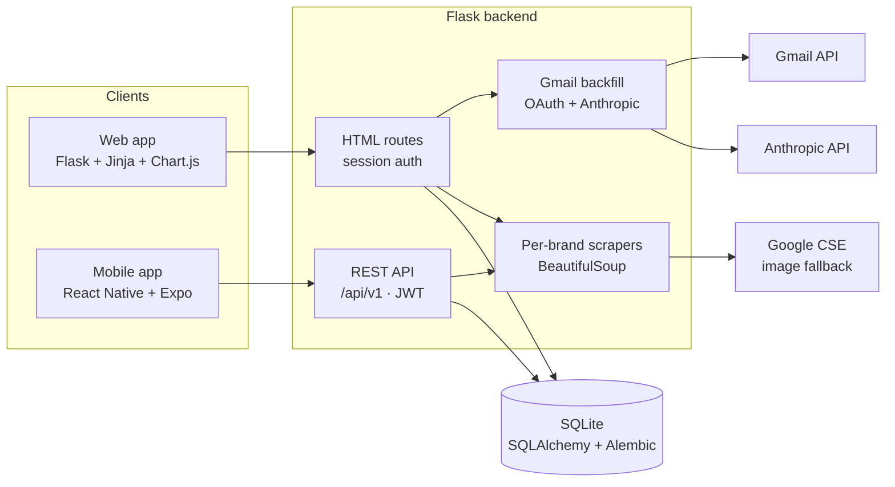

<div align="center">

# Unhooked

**A personal shopping tracker for curbing impulsive purchases.**

Track every online wish, every purchase, and — most importantly — every time you decided *not* to buy.

<p>
  
  
  
  
  
  
  
  
</p>


</div>

## Why I built this

It started with introspection — what emotions push me toward *Buy Now*, how long it usually takes before I realize I didn't actually need something, and what kind of intervention would feel helpful rather than punitive. Those reflections became the product:

- A wishlist with a built-in waiting period
- Spend *and* savings tracking, given equal weight
- An **unhooked** state for items I ultimately decided against

## Highlights

### Mindful by design
- 0-100 **Shopping Habits Score** with a credit-score-style gauge, scored over a rolling 90 days
- Calendar with hover details for every spend/save day
- Page-wide date-range filter governing the cards/graphs/pies (calendar and score are intentionally independent)

<!-- SCREENSHOT — calendar + line graphs + pie doughnuts on a card-wrapped page.
      -->

### Real data, not toy data
- Per-retailer URL scrapers (Zara, Reformation, Bloomingdale's, ba&sh, …) with Google CSE image fallback
- Gmail backfill: OAuth → Anthropic-extracted orders → Tinder-style swipe review before anything lands in the DB
- Cleanup scripts decode HTML entities and merge plural/casing variants (`Top`/`tops`/`TOPS` → `Tops`)

<!-- SCREENSHOT — Gmail backfill review UI (Tinder-style approve/deny).
      -->

### Web *and* mobile, one backend
- Flask + Jinja + Chart.js on the web; React Native (Expo) iOS/Android in `mobile/`
- One Flask app with two coexisting auth systems: Flask-Login for HTML, JWT for `/api/v1/`

<!-- SCREENSHOT (optional) — mobile app on a phone frame, e.g. wishlist tab.
      -->

## Architecture



## Engineering details I'm proud of

- **Two coexisting auth systems on one app.** Flask-Login for HTML routes, JWT for the REST API — added without rewriting the web side.
- **Pluggable scraping.** Each retailer is one method on a class; new brands take ~20 lines.
- **AI-assisted backfill with a human in the loop.** Gmail emails go to the Anthropic API for structured extraction, but every imported item passes through a swipe-style approval screen first. Audit rows in `BackfillReview` mean denials stick across scans.
- **Documented scoring criteria.** The Shopping Habits Score's buckets, weights, and tier thresholds live in `docs/shopping_habits_score.md` and the `SCORE_WEIGHTS` constant in `website/reports.py`. Tweaking weights doesn't require code archaeology.
- **Real-world data hygiene.** Scraped/backfilled text gets HTML-entity decoded and trimmed at every write site. Plural and casing variants of categories are normalized with a hand-curated protected set so `Pants` stays plural and `Beauty` doesn't become `Beauties`.
- **Two databases, two migration trees.** `database_dev.db` and `database_prod.db` with separate `migrations_dev/` and `migrations_prod/` so the dev/prod separation isn't just a port number.

## Tech stack

- **Backend:** Python 3.10+, Flask 3, SQLAlchemy 2, Alembic, Flask-Login, Flask-JWT-Extended, Flask-Limiter
- **Frontend (web):** Jinja2, Bootstrap 4, Chart.js, FullCalendar, custom CSS theme
- **Frontend (mobile):** React Native, Expo Router, TypeScript, Expo SecureStore
- **Integrations:** Anthropic API (structured email extraction), Gmail API (OAuth 2.0), Google Custom Search (image fallback), BeautifulSoup4 (per-brand HTML scraping)
- **Storage:** SQLite (dev + prod), separate Alembic migration trees per environment

## Quick start

```bash
git clone <repo-url>
cd unhooked
pip install -r requirements.txt
cp .env.example .env       # then fill in the values
```

Required env keys (see `.env.example`):
- `SECRET_KEY`, `JWT_SECRET_KEY` — generate with `python -c "import secrets; print(secrets.token_hex(32))"`
- `ANTHROPIC_API_KEY` — from console.anthropic.com → API Keys
- `GOOGLE_CLIENT_ID`, `GOOGLE_CLIENT_SECRET` — from Google Cloud Console (see [`ROADMAP.md`](ROADMAP.md))

Run:

```bash
FLASK_ENV=development python main.py   # → http://127.0.0.1:5001  (database_dev.db)
FLASK_ENV=production  python main.py   # → http://127.0.0.1:5000  (database_prod.db)
```

Mobile app:

```bash
cd mobile
npm install
npm start          # then press 'i' for iOS sim, or scan QR with Expo Go
```

> Physical-device testing: change `BASE_URL` in `mobile/services/api.ts` to your Mac's local IP (`ifconfig | grep "inet "`).

## Project structure

<details>
<summary>Directory layout</summary>

```
main.py                   # entry point
config.py                 # Config / ProductionConfig / DevelopmentConfig
website/
  __init__.py             # Flask factory, blueprint registration
  models.py               # SQLAlchemy models + normalize_category / clean_text
  views.py                # HTML routes (wishlist, unhooked-list, purchased-list)
  auth.py                 # login, signup, logout (Flask-Login)
  reports.py              # /home dashboard, charts, Shopping Habits Score
  api.py                  # /api/v1/* REST endpoints (JWT)
  url_extraction.py       # per-brand BeautifulSoup scrapers
  backfill.py             # Gmail OAuth + Anthropic-driven order import
  static/                 # CSS, JS, mascot images
  templates/              # Jinja2 templates
mobile/
  app/                    # Expo Router screens (auth + tabs)
  services/api.ts         # typed API client
docs/
  shopping_habits_score.md
scripts/
  backup_db.sh
  normalize_categories.py
  fix_html_entities.py
migrations_dev/
migrations_prod/
instance/
  database_template.db    # schema-only template (committed)
  database_dev.db         # local dev data (gitignored)
  database_prod.db        # local prod data (gitignored)
```

</details>

## Migrations

```bash
# dev
FLASK_ENV=development flask --app main db migrate -d migrations_dev -m "description"
FLASK_ENV=development flask --app main db upgrade -d migrations_dev

# prod
FLASK_ENV=production flask --app main db migrate -d migrations_prod -m "description"
FLASK_ENV=production flask --app main db upgrade -d migrations_prod
```

Live databases are never committed. `instance/database_template.db` is the only DB tracked in git — schema-only, regenerated from the model. Don't edit it directly.

## Gmail Backfill setup

See [`ROADMAP.md`](ROADMAP.md) for the full Google Cloud Console walk-through. Short version:

1. Create a project at console.cloud.google.com, enable the Gmail API.
2. OAuth consent screen → External, add yourself as a test user, scope `gmail.readonly`.
3. Create OAuth 2.0 credentials (Web app), redirect URI `http://localhost:5001/connectors/gmail/callback` (and/or `:5000` for prod).
4. Add `GOOGLE_CLIENT_ID` / `GOOGLE_CLIENT_SECRET` to `.env`.
5. Restart app → Settings → Connectors → Connect Gmail.

## Privacy

See [`PRIVACY.md`](PRIVACY.md) for data collection and third-party sharing details.

## Background process

```bash
sudo nohup FLASK_ENV=production python main.py > log.txt 2>&1 &
```
